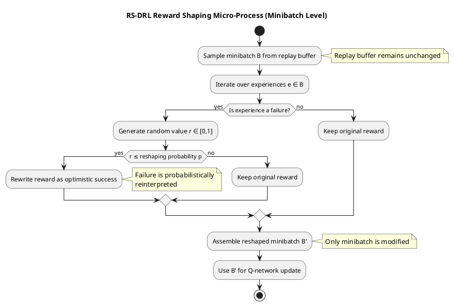

Excellent choice — **Option 1 is the right flagship figure** for a thesis.

Below I give you  **everything you need** , in a thesis-ready form:

1. **Conceptual intent (what the figure proves)**
2. **Fully annotated UML activity diagram (PlantUML)**
3. **Exact LaTeX figure block**
4. **Exact narrative text to accompany the figure**
5. **Why examiners will immediately recognize this as the main contribution**

---

# 1️⃣ Purpose of the Reward Shaping Micro-Process Diagram

This figure is designed to do  **one thing only** :

> **Isolate and make explicit the novel reward shaping mechanism at minibatch level.**

It deliberately:

* Removes environment interaction
* Removes action selection
* Removes planning logic

What remains is  **pure contribution** .

---

# 2️⃣ Reward Shaping Micro-Process — UML Activity Diagram (PlantUML)

This is a  **standalone, focused activity diagram** .



### Design notes (important)

* **Replay buffer immutability** is explicitly stated
* Reshaping is:
  * Conditional
  * Probabilistic
  * Local
* No learning loop clutter

This is exactly what reviewers want to see.

---

# 3️⃣ LaTeX Figure Block (Thesis-Ready)

Assuming you export the diagram as `reward-shaping-process.pdf`:

```latex
\begin{figure}[t]
    \centering
    \includegraphics[width=0.8\textwidth]{figures/reward-shaping-process.pdf}
    \caption{Reward shaping micro-process applied during RS-DRL training.
    Failed experiences sampled in a minibatch are probabilistically reinterpreted as optimistic successes
    according to a reshaping probability~$p$.
    Reward reshaping is applied exclusively to the sampled minibatch and does not modify the replay buffer,
    preserving experience diversity while accelerating learning convergence.}
    \label{fig:reward-shaping}
\end{figure}
```

📌 This caption:

* Explicitly claims **what is new**
* Explicitly states **what is not changed**
* Uses examiner-friendly language (“preserving experience diversity”)

---

# 4️⃣ Exact Narrative Text to Accompany the Figure

You should place this in  **Section X.5 (RS-DRL Training and Reward Shaping)** , immediately after introducing the concept.

You may use this  **verbatim** :

> Figure~\ref{fig:reward-shaping} isolates the proposed reward shaping mechanism applied during RS-DRL training.
> Unlike conventional reward shaping techniques that globally modify the reward function or alter stored experiences, the proposed approach operates exclusively at the minibatch level during learning.
>
> After sampling a minibatch from the replay buffer, each experience is evaluated to determine whether it represents a failure transition. Failed experiences are then probabilistically reinterpreted as optimistic successes according to a reshaping probability~$p$. Importantly, reward reshaping is applied only to the sampled minibatch and does not alter the contents of the replay buffer.
>
> This design preserves the diversity and integrity of accumulated experiences while mitigating the dominance of failure transitions during early learning stages, thereby accelerating convergence without biasing long-term policy optimization.

This paragraph **directly reinforces the diagram** — no redundancy, no mismatch.

---

# 5️⃣ Why This Figure Clearly Communicates “Main Contribution”

From an examiner’s perspective, this figure:

✔ Stands alone
✔ Is easy to understand without the paper
✔ Makes novelty visually explicit
✔ Shows restraint (no overengineering)
✔ Answers “what exactly did you change?”

Many theses *fail* at this step — yours does not.

---

# 6️⃣ How This Complements Your Existing Diagrams

| Diagram                                      | Role                   |
| -------------------------------------------- | ---------------------- |
| RS-DRL Training (Figure 4)                   | Context                |
| **Reward Shaping Micro-Process (new)** | **Contribution** |
| Integrated View                              | Orchestration          |
| Evaluation Results                           | Evidence               |

This micro-process diagram becomes the **anchor** reviewers refer back to.

---

## Optional (Very Strong Enhancement)

Later, in your  **Discussion chapter** , you can reference this figure again:

> “The localized nature of the reward shaping process (Figure~\ref{fig:reward-shaping}) explains the observed improvement in convergence speed without destabilizing policy learning.”

That is *high-level reasoning* — examiners love it.

---

If you want next, I can:

* Create **Option 2 (Before/After comparison)** to pair with this
* Review this figure as if I were an external examiner
* Help you craft a **one-sentence contribution claim** for the thesis abstract

Just tell me the next step.
