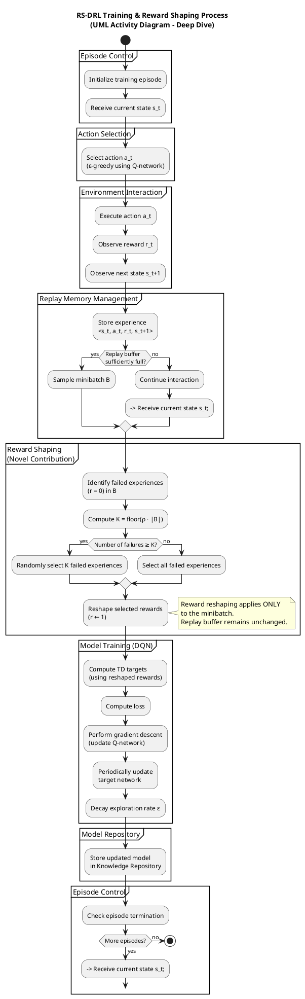

Excellent — this is exactly the right way to do it.
I’ll proceed in **two clearly separated steps**, as you asked:

1. **Propose the internal structure** of the RS-DRL training & reward-shaping process (conceptual decomposition, decisions, loops).
2. **Provide a fully annotated UML Activity Diagram** (PlantUML), faithful to Algorithms 1 & 2 and Figure 4.

---

# 1️⃣ Internal Structure of the RS-DRL Training & Reward-Shaping Process

This process is **not monolithic**. It consists of **four tightly coupled sub-processes**, each with a distinct responsibility and control logic.

---

## A. Episode & Interaction Control (Outer Loop)

**Purpose:**
Controls *when* learning happens and *how* experience is generated.

**Key characteristics:**

* Episodic (but continuous in runtime)
* Environment-driven
* Produces raw experience tuples

**Internal steps:**

1. Initialize episode
2. Receive current state ( s_t )
3. Select action ( a_t ) (ε-greedy)
4. Execute action in environment
5. Observe reward ( r_t ) and next state ( s_{t+1} )

📌 **Important modeling note:**
This is where *exploration vs exploitation* lives — do not bury it inside training.

---

## B. Experience Management (Replay Memory)

**Purpose:**
Decouple data generation from learning (stability & sample efficiency).

**Internal steps:**

1. Store transition ⟨s, a, r, s′⟩
2. Check if replay buffer has enough samples
3. Sample minibatch ( B )

📌 **Decision point:**

> “Is replay buffer sufficiently populated?”

If **no** → continue collecting experience
If **yes** → trigger learning

---

## C. Novel Reward Shaping (Core Contribution)

**Purpose:**
Prevent local optima by **reinterpreting selected failures as optimistic successes**.

**Internal logic (Algorithm 2):**

1. Identify failed experiences (r = 0)
2. Compute number to reshape: ( K = \lfloor \rho \cdot |B| \rfloor )
3. Randomly select failed transitions
4. Replace reward with constant optimistic value (1)
5. Leave original buffer untouched

📌 **Critical modeling insight:**
Reward shaping happens **only on the sampled minibatch**, not globally.

This must be visually explicit.

---

## D. Model Training & Update

**Purpose:**
Update the policy/value approximation using reshaped experience.

**Internal steps:**

1. Compute TD targets using reshaped rewards
2. Compute loss
3. Perform gradient descent
4. Periodically update target network
5. Decay exploration rate ε
6. Store updated model

📌 **Boundary clarity:**
This is the *only* place where network weights change.

---

## E. Outputs & Interfaces

**Outputs:**

* Updated Q-network
* Stored trained model in Knowledge Repository

**Interfaces:**

* Input: state vector (from Monitor)
* Output: trained model (used later by Planner)

---

### ✅ Summary of Internal Structure

```
Episode Control
   ↓
Experience Collection
   ↓
Replay Memory
   ↓
Reward Shaping (novel)
   ↓
Model Training
   ↓
Model Storage
   ↺ repeat
```

This structure is what your diagram must preserve.

---

# 2️⃣ Fully Annotated UML Activity Diagram

### RS-DRL Training & Reward Shaping (PlantUML)

This diagram:

* Is **fully faithful** to Algorithms 1 & 2
* Uses **explicit decision nodes**
* Clearly isolates the **novel reward shaping logic**
* Is **standalone** (no MAPE-K yet)

---



---

## How This Diagram Should Be Used

### In a thesis / paper

You can explicitly state:

> “Figure X details the internal RS-DRL training process, highlighting the novel reward-shaping phase applied during experience replay, as formalized in Algorithms 1 and 2.”

### In a defense or review

This diagram:

* Clearly separates **standard DQN components** from **novel contributions**
* Makes the **optimistic failure reinterpretation** explicit and defensible

---

## Next Logical Step

Once you’re ready, the **natural continuation** is:

👉 **Diagram 2: Adaptation Option Prediction (Runtime-Only Path)**
(where learning is *disabled* and the trained model is *consumed*)

When you’re ready, say the word and we’ll proceed with the same rigor.
