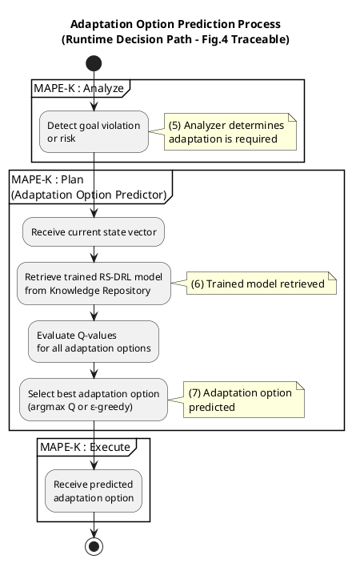

Great — we now move to **Diagram 2: Adaptation Option Prediction (Runtime-Only Path)**.
As before, I will proceed in **two disciplined steps**:

1. **Propose the internal structure** (what exists, what does *not* exist, and why).
2. **Provide a fully annotated UML Activity Diagram** (PlantUML), traceable to Figure 4.

---

# 1️⃣ Internal Structure of the Adaptation Option Prediction Process

## Purpose of this process

This process represents **runtime decision-making**, *not learning*.
It answers one question only:

> *“Given the current system state, which adaptation option should be executed now?”*

---

## What this process **intentionally excludes**

This is crucial for correctness.

❌ No replay memory
❌ No reward shaping
❌ No training / gradient descent
❌ No environment exploration

Those belong **only** to Diagram 1.

---

## Core Characteristics

| Aspect      | Description                                 |
| ----------- | ------------------------------------------- |
| Trigger     | Goal violation or risk detected by Analyzer |
| Frequency   | Event-driven (not continuous)               |
| Determinism | Mostly exploitative (ε≈0 or low)          |
| Output      | One adaptation option                       |
| Dependency  | Trained RS-DRL model                        |

---

## A. Trigger & Preconditions

**Trigger condition**

* Analyzer determines:

  * Goals violated, **or**
  * Goals predicted to be violated

**Preconditions**

* A trained RS-DRL model exists in Knowledge
* Current system state is available

📌 *This process does not start on its own.*

---

## B. State Acquisition & Preparation

**Responsibilities**

1. Receive latest state vector
2. Ensure compatibility with model input

**Why separate this step**

* Keeps prediction independent from monitoring details
* Allows reuse across different planners

---

## C. Model Retrieval (Knowledge Access)

**Responsibilities**

1. Retrieve latest trained Q-network
2. Validate model availability

**Decision**

* If no model exists → fallback strategy (often omitted in the paper, but good modeling practice)

---

## D. Action Evaluation & Selection

**Responsibilities**

1. Feed state into Q-network
2. Compute Q-values for all actions
3. Select action:

   * Argmax(Q) (pure exploitation)
   * Or ε-greedy with very small ε

📌 *This is the conceptual “brain” of adaptation.*

---

## E. Output & Handoff

**Responsibilities**

1. Output predicted adaptation option
2. Pass it to Executor
3. End process

This clean separation makes it easy to:

* Replace the learner
* Compare planners
* Reason about correctness

---

## Structural Summary

```
Analyzer trigger
   ↓
State acquisition
   ↓
Model retrieval
   ↓
Action evaluation
   ↓
Adaptation option output
```

This structure mirrors **Figure 4 arrows (5–7)** exactly.

---

# 2️⃣ Fully Annotated UML Activity Diagram

### Adaptation Option Prediction (Runtime-Only)

This diagram:

* Is **strictly runtime**
* Uses **Figure 4 arrow numbers**
* Can be referenced independently in your document

---



---

## How This Diagram Fits into the Bigger Picture

| Diagram             | Role                            |
| ------------------- | ------------------------------- |
| Diagram 1           | *How the model is learned*    |
| **Diagram 2** | **How the model is used** |
| Diagram 3 (next)    | How decisions are enforced      |
| Diagram 4           | How options are evaluated       |
| Diagram 5           | How states are observed         |

This separation is exactly what reviewers expect when evaluating **learning-based self-adaptive systems**.

---

## Next Logical Step

The next step is now **Diagram 3: MAPE-K Adaptation Control Loop**, where we:

* Embed Diagram 2 inside the Planner
* Explicitly model **Analyze → Plan → Execute**
* Capture the paper’s **change-detection assumption**

When you’re ready, say:

👉 *“Proceed with Diagram 3”*
