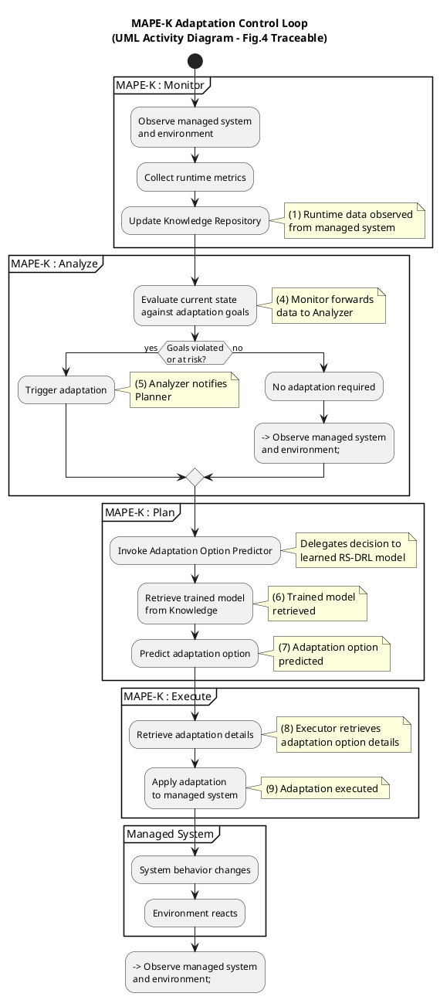

Excellent — we now move to **Diagram 3: the MAPE-K Adaptation Control Loop**.
This diagram is **architecturally central**: it explains *when* adaptation happens, *why* it happens, and *how* learned intelligence is invoked.

As before, I’ll proceed in **two disciplined steps**:

1. **Propose the internal structure** (deep, but controlled).
2. **Provide a fully annotated UML Activity Diagram**, traceable to Figure 4 and consistent with Diagrams 1 & 2.

---

# 1️⃣ Internal Structure of the MAPE-K Adaptation Control Loop

## Purpose of this diagram

This diagram answers the question:

> **“How does the system decide to adapt, and how does it orchestrate adaptation?”**

It is **control logic**, not learning logic.

---

## Key Modeling Principle

MAPE-K is **event-driven**, not continuous optimization.

Adaptation happens **only when analysis detects risk or violation**.

This is explicitly stated as an **operational assumption** in Section 4.1.1 of the paper .

---

## A. Monitor Phase (Observation & Synchronization)

### Responsibilities

* Continuously observe:

  * System state
  * Environmental context
* Update Knowledge Repository

### Outputs

* State vector
* Performance metrics
* Deviations from expected behavior

📌 **Modeling insight**
The Monitor:

* Does *not* decide
* Does *not* adapt
* Does *not* learn

It only **synchronizes reality with knowledge**.

---

## B. Analyze Phase (Change Detection & Decision Trigger)

### Responsibilities

* Evaluate monitored data
* Detect:

  * Goal violation
  * Goal *risk* (trend-based or predictive)

### Critical Decision Point

> “Are adaptation goals violated or likely to be violated?”

This is the **single most important decision node** in the entire architecture.

📌 **Why it matters**

* Prevents unnecessary adaptation
* Controls computational cost
* Triggers the Planner

---

## C. Plan Phase (Delegation, Not Computation)

### Responsibilities

* Decide *how* to obtain an adaptation option
* Delegate prediction to:

  * **Adaptation Option Predictor** (Diagram 2)

📌 **Important modeling rule**
The Planner:

* Does **not** search the adaptation space
* Does **not** evaluate rewards
* Does **not** learn

It **orchestrates decision-making**.

---

## D. Execute Phase (Enactment & Enforcement)

### Responsibilities

* Retrieve full adaptation details
* Apply changes to Managed System
* Ensure correct execution order

📌 **Boundary clarity**
Execution is:

* Deterministic
* Non-intelligent
* The final step before system behavior changes

---

## E. Feedback Closure (Loop Completion)

Once execution completes:

* System behavior changes
* Environment reacts
* Monitoring resumes

This closes the **control loop**.

---

## Structural Summary

```
Monitor
   ↓
Analyze
   ↓ (decision)
Plan
   ↓
Execute
   ↓
Managed System changes
   ↺ Monitor
```

This structure corresponds directly to **Figure 4 arrows (1, 4, 5, 6–9)**.

---

# 2️⃣ Fully Annotated UML Activity Diagram

### MAPE-K Adaptation Control Loop (Figure 4 Traceable)

This diagram:

* Embeds **Diagram 2** (prediction) as a subprocess
* Shows **explicit decision logic**
* Clearly separates *control* from *learning*

---



---

## How This Diagram Should Be Positioned in Your Work

You can now clearly state:

> “Figure X illustrates the MAPE-K adaptation control logic, highlighting how runtime monitoring and analysis trigger adaptation and how decision-making is delegated to the RS-DRL-based predictor.”

This diagram:

* Explains **control flow**
* Avoids duplicating learning logic
* Makes architectural responsibilities explicit

---

## What Comes Next (Recommended)

The next logical deep dive is:

👉 **Diagram 4: Adaptation Option Verification (UPPAAL-SMC & Runtime Models)**

This will:

* Explain *why* rewards are trustworthy
* Show how quality attributes are estimated
* Complete the learning-decision-execution chain

When ready, just say:

**“Proceed with Diagram 4.”**
