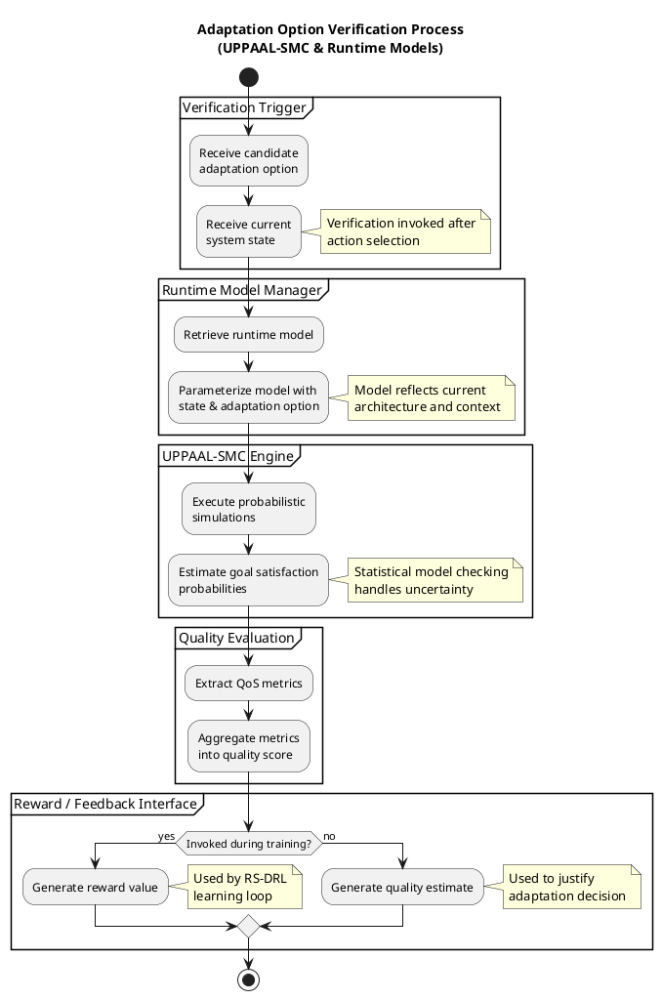

Perfect — we now complete the **intellectual core** of the paper with
**Diagram 4: Adaptation Option Verification (UPPAAL-SMC & Runtime Models)**.

This diagram is subtle but *crucial*: it explains **why RS-DRL decisions are safe, meaningful, and goal-aware**, and it connects learning with formal verification.

As before, I’ll proceed in **two rigorous steps**:

---

# 1️⃣ Internal Structure of the Adaptation Option Verification Process

## Purpose of this process

This process answers:

> **“How does the system evaluate whether a selected adaptation option is good, safe, and goal-compliant?”**

It sits **between decision and reward**, and it is used:

* During **training** (to compute rewards)
* Conceptually during **planning justification**

---

## Key Architectural Role

Verification acts as a **semantic filter** between:

* *What the learner proposes*
* *What the system should trust*

Without this process:

* Rewards are arbitrary
* Learning may converge to unsafe policies

---

## A. Input Acquisition

### Inputs

* Candidate adaptation option
* Current system state
* Runtime models (formal behavioral models)
* Quality goals (QoS constraints)

📌 **Modeling insight**
Verification does **not** choose actions — it evaluates them.

---

## B. Runtime Model Configuration

### Responsibilities

1. Parameterize runtime model with:

   * Current state
   * Selected adaptation option
2. Prepare probabilistic model for analysis

This step bridges **software architecture** and **formal verification**.

---

## C. Statistical Model Checking (SMC)

### Responsibilities

1. Execute simulations using UPPAAL-SMC
2. Estimate probabilities of:

   * Goal satisfaction
   * QoS compliance
3. Handle uncertainty explicitly

📌 **Important modeling detail**

* This is **probabilistic**, not deterministic
* Results are estimates, not guarantees

---

## D. Quality Evaluation & Scoring

### Responsibilities

1. Extract QoS metrics
2. Aggregate them into:

   * Scalar reward (training)
   * Quality estimate (planning)

This is where **verification results become learning signals**.

---

## E. Feedback Routing

### Outputs depend on context:

| Context  | Output                     |
| -------- | -------------------------- |
| Training | Reward value               |
| Planning | Quality score / confidence |

In Diagram 4 we focus on the **evaluation pipeline itself**, not the consumer.

---

## Structural Summary

```
Adaptation option
   ↓
Runtime model instantiation
   ↓
UPPAAL-SMC simulation
   ↓
QoS estimation
   ↓
Reward / quality output
```

This corresponds to **Figure 4 arrows (part of 2, 3)**.

---

# 2️⃣ Fully Annotated UML Activity Diagram

### Adaptation Option Verification (UPPAAL-SMC)

This diagram:

* Is reusable by both **learning** and **planning**
* Makes **uncertainty handling explicit**
* Clearly isolates formal verification from control logic

---



---

## How This Diagram Strengthens Your Overall Model

With Diagram 4, you now have:

| Diagram             | Explains                                |
| ------------------- | --------------------------------------- |
| Diagram 1           | *How learning happens*                |
| Diagram 2           | *How decisions are made*              |
| Diagram 3           | *When adaptation is triggered*        |
| **Diagram 4** | **Why decisions are trustworthy** |

This is exactly the **chain of reasoning reviewers look for** in learning-based self-adaptive systems.

---

## Final Remaining Step

Only one diagram remains to fully decompose Figure 4:

👉 **Diagram 5: Monitoring & State Construction**

This will:

* Complete the closed loop
* Show how raw runtime data becomes a learning-ready state
* Tie environment uncertainty back into RS-DRL

When ready, say:

**“Proceed with Diagram 5.”**
