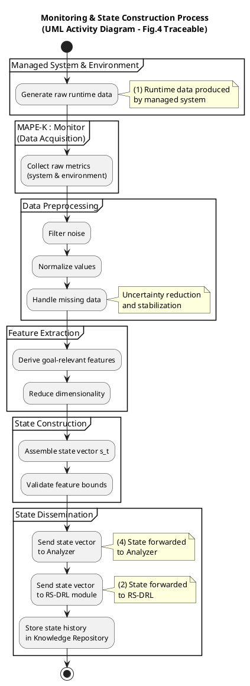

Great — this is the  **final decomposition step** .
**Diagram 5: Monitoring & State Construction** closes the loop and explains  *how uncertainty from the real world is transformed into something the learner and planner can reason about* .

As before, I’ll proceed in  **two disciplined stages** :

1. **Propose the internal structure** (what this process must contain and why).
2. **Provide a fully annotated UML Activity Diagram** , traceable to Figure 4 and consistent with Diagrams 1–4.

---

# 1️⃣ Internal Structure of Monitoring & State Construction

## Purpose of this process

This process answers:

> **“How does raw, uncertain runtime data become a state vector usable by RS-DRL and MAPE-K?”**

This is  **not passive sensing** .
It is an  **interpretation and abstraction pipeline** .

---

## Why this process deserves its own diagram

Many papers hide monitoring behind a single arrow.
This paper  **cannot** , because:

* RS-DRL depends critically on **state representation**
* Uncertainty originates here
* Poor abstraction = poor learning

---

## A. Runtime Data Acquisition (Sensing Layer)

### Responsibilities

* Collect raw data from:
  * Managed system
  * Execution environment

### Examples

* Resource usage
* Network conditions
* Request rates
* System configuration

📌 **Modeling insight**
This step is continuous and asynchronous.

---

## B. Data Preprocessing & Filtering

### Responsibilities

* Noise reduction
* Normalization
* Missing value handling
* Time-window aggregation

📌 **Why this matters**
RS-DRL assumes  *stationary input distributions* .
This step enforces that assumption as much as possible.

---

## C. Feature Extraction

### Responsibilities

* Map raw metrics → meaningful features
* Reduce dimensionality
* Preserve goal-relevant information

📌 **Key constraint**
Features must:

* Match training-time expectations
* Remain consistent across episodes

---

## D. State Vector Construction

### Responsibilities

* Assemble features into:
  * State vector ( s_t )
* Validate structure and bounds

📌 **Interface guarantee**
This is the **contract** between:

* Monitoring
* Learning (Diagram 1)
* Prediction (Diagram 2)

---

## E. State Dissemination

### Outputs

* State vector forwarded to:
  * RS-DRL (training or prediction)
  * Analyzer (goal evaluation)
  * Knowledge Repository (history)

This corresponds directly to  **Figure 4 arrows (1, 2, 4)** .

---

## Structural Summary

```
Raw runtime data
   ↓
Preprocessing
   ↓
Feature extraction
   ↓
State vector construction
   ↓
State consumers
```

This process is  **purely observational** , but architecturally decisive.

---

# 2️⃣ Fully Annotated UML Activity Diagram

### Monitoring & State Construction (Figure 4 Traceable)

This diagram:

* Completes the closed loop
* Shows where uncertainty enters the system
* Makes state abstraction explicit

---



---

## What You Have Achieved (Big Picture)

You now have a **complete, defensible decomposition** of Figure 4:

| Diagram | Responsibility                   |
| ------- | -------------------------------- |
| 1       | RS-DRL Training & Reward Shaping |
| 2       | Adaptation Option Prediction     |
| 3       | MAPE-K Adaptation Control Loop   |
| 4       | Adaptation Option Verification   |
| 5       | Monitoring & State Construction  |

Together, these diagrams:

* Are **non-overlapping**
* Are **traceable to Figure 4**
* Clearly separate **learning, control, verification, and observation**
* Are suitable for **thesis chapters or a multi-figure journal paper**

---

## Recommended Final Step (Optional but Powerful)

If you want to elevate this even further, the next step would be to:

👉 **Create an integration diagram** showing how Diagrams 1–5 compose into Figure 4
or
👉 **Add formal contracts** (inputs/outputs/invariants) to each diagram

If you tell me your end goal (thesis, journal submission, design doc), I can help you finalize this into a publication-ready artifact.
