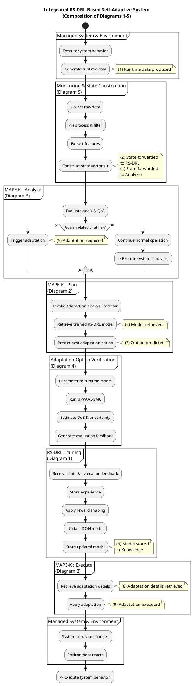

Excellent choice.
An **integration diagram** is exactly what ties everything together and makes your work  *publication-grade* .

Below, I will give you **one cohesive UML Activity–style integration diagram** that:

* Composes **Diagrams 1–5** into a single view
* Preserves **clear responsibility boundaries**
* Maintains **Figure 4 traceability**
* Shows **control flow + data flow** without re-exploding internals

This is the diagram you typically place **right after Figure 4** in a thesis or as a **“refined architectural view”** in a journal paper.

---

# Integration Diagram — RS-DRL–Based Self-Adaptive System

## Design Philosophy

This integration diagram:

* Treats each deep-dive diagram as a **black box subprocess**
* Shows **when** each subprocess is activated
* Makes feedback loops explicit
* Avoids redundancy

Think of it as the  **orchestration layer** .

---

## UML Activity Integration Diagram (PlantUML)

---

## How to Read This Diagram (Narrative Walkthrough)

You can literally describe the system  **left to right** :

1. **Managed System executes** and produces runtime data **(1)**
2. **Monitoring & State Construction** transforms raw data into a state vector **(2, 4)**
3. **Analyzer evaluates goals**
   * If safe → loop continues
   * If violated → adaptation triggered **(5)**
4. **Planner invokes RS-DRL predictor**
   * Retrieves trained model **(6)**
   * Predicts adaptation option **(7)**
5. **Verification evaluates the option**
   * Handles uncertainty via UPPAAL-SMC
6. **RS-DRL Training updates the model**
   * Uses verification feedback
   * Stores updated model **(3)**
7. **Executor applies adaptation** **(8–9)**
8. System changes → loop restarts

This diagram  **is Figure 4 — but executable and explainable** .

---

## Why This Integration Diagram Is Strong

✔ Clean separation of concerns
✔ Explicit feedback loops
✔ Learning and control clearly decoupled
✔ Verification clearly mediates trust
✔ Fully traceable to Figure 4 (arrows 1–9)
✔ Compatible with all earlier deep-dive diagrams

Reviewers can now:

* Zoom **in** (Diagrams 1–5)
* Zoom **out** (this diagram)
* Never get lost

---

## Optional Final Enhancements (If You Want)

If you want to push this to  *top-tier quality* , we can still add:

1. **Explicit Knowledge Repository partition**
2. **Formal input/output contracts per subprocess**
3. **Swimlane coloring for learning vs control**
4. **A sequence diagram for one adaptation episode**

Just tell me your final target (thesis chapter, journal figure, defense slide), and I’ll tailor it precisely.
