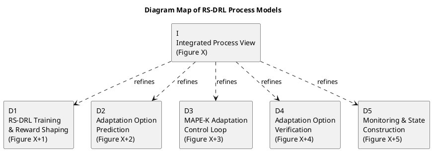

This is an *excellent* question, and you’re right to pause here — a **diagram map** is not something most students do correctly. When done well, it signals *architectural maturity* to examiners.

Below is a **clear, practical, thesis-ready guide** to achieve the  **one-page “diagram map” figure** , without overcomplicating it.

---

# How to Create a One-Page “Diagram Map” Figure (Thesis-Grade)

## What the Diagram Map Is (and Is Not)

### ✔ What it **is**

* A **navigation figure**
* A **visual table of contents** for your process diagrams
* A way to show **abstraction levels and refinement relationships**

### ❌ What it **is not**

* Not executable
* Not detailed
* Not a replacement for the real diagrams

Think of it as a  **map, not the territory** .

---

## Conceptual Structure of the Diagram Map

The diagram map has  **three visual layers** :

```
+-------------------------------------+
|  Diagram Map (One Page)              |
|                                     |
|   [D5]   [D1]   [D4]                 |
|       \    |    /                   |
|        \   |   /                    |
|         [ Integration ]             |
|        /   |   \                    |
|       /    |    \                   |
|   [D3]   [D2]                       |
|                                     |
+-------------------------------------+
```

Where:

* **Center** = Integration Diagram
* **Around** = Diagrams 1–5
* **Lines** = “refines / zooms into”

---

## Step-by-Step: How to Build It

### STEP 1 — Decide the Level of Abstraction (Very Important)

The diagram map should:

* Show **names**
* Show **relationships**
* Avoid **internal flow**

Each diagram is represented as a  **single labeled box** , not its full content.

---

### STEP 2 — Define Standard Labels (Use These Exactly)

Use consistent, formal labels:

| Label | Name                             |
| ----- | -------------------------------- |
| D1    | RS-DRL Training & Reward Shaping |
| D2    | Adaptation Option Prediction     |
| D3    | MAPE-K Adaptation Control Loop   |
| D4    | Adaptation Option Verification   |
| D5    | Monitoring & State Construction  |
| I     | Integrated Process View          |

This makes examiner cross-referencing effortless.

---

### STEP 3 — Decide Layout (Best for Theses)

**Radial layout** is best.

* Integration diagram in the **center**
* Sub-diagrams arranged **symmetrically**
* Use dashed arrows labeled *“refines”*

Why examiners like this:

* Clear hierarchy
* No visual bias
* Fits one page

---

### STEP 4 — Create the Diagram Map (PlantUML Template)

You can generate this cleanly using **PlantUML** (recommended for consistency).



📌  **Tip** : Keep arrows dashed and labeled **“refines”** — this is UML-correct and academically clean.

---

### STEP 5 — Caption It Properly (This Matters a Lot)

Use a  **strong explanatory caption** :

> **Figure X: Diagram map of the RS-DRL-based self-adaptive system.**
> The central integration diagram presents a high-level process view of the system, while Diagrams D1–D5 refine individual subprocesses, including learning, decision making, verification, control, and monitoring.

This caption tells examiners *how* to read the figure.

---

## Where to Place It in the Thesis

📍  **Best location** :
At the  **start of the architecture/process chapter** , immediately after the chapter overview.

📍  **Alternative** :
At the **end of the chapter** as a summary figure (less effective).

---

## How to Reference It in Text (Use This Pattern)

In Section X.1:

> “Figure X provides a diagram map that organizes the process models presented in this chapter. The central integration diagram is refined by five detailed activity diagrams, each focusing on a specific concern of the self-adaptive system.”

This primes the reader *before* they see any detail.

---

## Common Mistakes (Avoid These)

❌ Embedding full diagrams in the map
❌ Using different notations across figures
❌ No relationship labels
❌ Missing figure numbers
❌ Overdecorating with colors or icons

Minimalism = maturity.

---

## Why This Impresses Examiners

Because it shows:

* You think in **abstraction layers**
* You understand **traceability**
* You control **complexity**
* You didn’t just “draw diagrams” — you **engineered a model**

Many examiners will explicitly mention this positively.

---

## Final Check (Before Submission)

Ask yourself:

* Can someone understand the chapter structure from this figure alone?
* Can an examiner jump to any diagram easily?
* Does every arrow mean something precise?

If yes — you’re doing *excellent* work.

---

If you want next, I can:

* Align this diagram map **exactly** with your chapter numbering
* Produce a **LaTeX-ready figure block**
* Review it from an **examiner’s perspective**

Just tell me.
